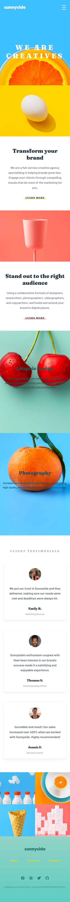

# Frontend Mentor - Sunnyside agency landing page solution

This is a solution to the [Sunnyside agency landing page challenge on Frontend Mentor](https://www.frontendmentor.io/challenges/agency-landing-page-7yVs3B6ef). Frontend Mentor challenges help you improve your coding skills by building realistic projects.

## Table of contents

- [Overview](#overview)
  - [The challenge](#the-challenge)
  - [Screenshot](#screenshot)
  - [Links](#links)
- [My process](#my-process)
  - [Built with](#built-with)
  - [What I learned](#what-i-learned)
  - [Features implemented](#features-implemented)
- [Author](#author)

## Overview

### The challenge

Users should be able to:

- View the optimal layout for the site depending on their device's screen size
- See hover states for all interactive elements on the page
- Experience smooth animations and transitions
- Navigate smoothly between sections
- Interact with a fully functional mobile menu

### Screenshot





### Links

- Solution URL: [GitHub Repository](https://github.com/Mugisho-dev-metasploit/Sunnyside-Agency-Landing-Page-Frontend-Mentor-challenge-05)
- Live Site URL: [https://mugisho-dev-metasploit.github.io/Sunnyside-Agency-Landing-Page-Frontend-Mentor-challenge-05/](https://mugisho-dev-metasploit.github.io/Sunnyside-Agency-Landing-Page-Frontend-Mentor-challenge-05/)

## My process

### Built with

- **Semantic HTML5 markup** - Proper heading hierarchy and semantic elements
- **CSS3** - Custom properties, flexbox, grid, and animations
- **Tailwind CSS** - Utility-first CSS framework for rapid styling
- **PostCSS & Autoprefixer** - CSS preprocessing and vendor prefixing
- **Vanilla JavaScript** - Interactive features and DOM manipulation
- **Mobile-first workflow** - Responsive design approach
- **Custom animations** - Bounce, fade-in, scale, and slide-up animations
- **Intersection Observer API** - Lazy loading and trigger animations on scroll
- **CSS Grid & Flexbox** - Modern layout techniques

### What I learned

Through this project, I enhanced my skills in:

1. **Advanced CSS Animations**: Created smooth, sophisticated animations using keyframes with proper timing and easing functions
2. **Responsive Design**: Built a fully responsive layout that works seamlessly across mobile, tablet, and desktop viewports
3. **Tailwind CSS Mastery**: Extended Tailwind with custom animations and utilized utility-first approach effectively
4. **JavaScript DOM Manipulation**: Implemented mobile menu toggle, scroll tracking, and active navigation highlighting
5. **Accessibility**: Added proper ARIA attributes, keyboard navigation, and focus states
6. **Performance Optimization**: Used intersection observers for efficient animations and lazy loading
7. **CSS Architecture**: Organized styles with clear separation of concerns using layer organization

```html
<section class="grid grid-cols-1 md:grid-cols-2 gap-0">
  <!-- Responsive grid layout with image and content -->
</section>
```

```css
@keyframes fadeInUp {
  from {
    opacity: 0;
    transform: translateY(30px);
  }
  to {
    opacity: 1;
    transform: translateY(0);
  }
}
```

```js
// Smooth scroll to sections
document.querySelectorAll('a[href^="#"]').forEach(link => {
  link.addEventListener('click', (e) => {
    e.preventDefault();
    const target = document.getElementById(href.substring(1));
    target?.scrollIntoView({ behavior: 'smooth', block: 'start' });
  });
});
```

### Features implemented

✨ **Enhanced Features Beyond Design**:
- ✅ Smooth scroll behavior across all sections
- ✅ Animated scroll progress bar at the top
- ✅ Active navigation link highlighting on scroll
- ✅ Bounce animation on scroll down arrow
- ✅ Scale animation on testimonial cards
- ✅ Parallax effect on hero images
- ✅ Hover effects on all interactive elements
- ✅ Form validation helper functions
- ✅ Accessibility improvements (ARIA labels, keyboard navigation)
- ✅ Mobile-responsive navigation with hamburger menu
- ✅ Custom Tailwind configuration with animations and shadows
- ✅ Intersection Observer for efficient animations

## Author

- **Website/Portfolio**: [GitHub Profile](https://github.com/Mugisho-dev-metasploit)
- **Frontend Mentor**: [@Mugisho-dev-metasploit](https://www.frontendmentor.io/profile/Mugisho-dev-metasploit)
- **GitHub**: [@Mugisho-dev-metasploit](https://github.com/Mugisho-dev-metasploit)
- **Upwork**: [Freelancer Profile](https://www.upwork.com/freelancers/~01a2f97f4e3bb50a4c?mp_source=share)
